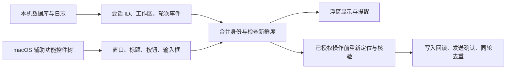

# 会话与界面识别

本文依据 `Sources/`、`collector/`、`supervisor/` 的实现说明任务雷达的识别机制。会话身份、轮次状态和当前可操作界面分别核验；其中一项成立不能替代其他项。

## 两条证据链

**本地会话读取**用于发现后台对话。适配器读取各软件的本地索引、数据库和结构化事件，整理会话 ID、标题、工作目录、真实轮次起止和中断原因。Codex 还将数据库投影与 rollout 生命周期事件、持有该会话写锁的进程相互核对。日志的修改时间或软件进程存在不能单独证明某条对话正在运行。

**界面读取**通过 macOS Accessibility（辅助功能，AX）获取应用暴露的窗口与控件属性。原生监控主要读取标题、按钮名称及可用状态；续接桥在操作时进一步检查当前项目、对话标题、唯一聊天输入框和发送控件。仅发现一个应用不等于已经读到其中全部对话，也不代表它支持自动输入。

目前的识别实现主要使用这些结构化信息，没有通用截图视觉模型来理解整块屏幕上的文章、图片或视频。目标应用若没有暴露可读控件、稳定会话入口或本地数据，需要专门适配；只靠屏幕上的相似文字不足以安全定位原会话。

## 最难的部分

1. **稳定身份。** 同一项目可以有多条对话，不同项目也可能有同名标题。优先使用稳定会话 ID、完整工作目录和对应跳转目标。只有工作区入口的软件，需要在原生搜索中核验结果，再核验打开后的当前项目与标题。同项目同名、目标变化或身份不明时拒绝输入。
2. **真实轮次与新鲜度。** 数据库投影可能落后于日志；旧轮的完成记录也可能晚于新轮出现。按 turn ID 和文件位置重放事件，保留明确的本轮起止。长日志采用有界分块回溯与增量缓存，避免一次读完整日志；替换、截短和同长度改写须使缓存失效。有效身份但状态未知的 Codex 会话可以显示“待确认”，仍不计入活动数字或获得自动发送权限。
3. **持续刷新而不拖慢界面。** 各软件采集速度不同。后台采集按来源并行，每个适配器最多保留一个在途任务；慢来源保留身份并降级状态，其他来源继续更新。原生窗口扫描也有时间和节点预算。旧回调、采集器无响应和过期快照不能维持旧的可信运行状态。
4. **动态控件与焦点。** 搜索结果、聊天历史和输入框会分批加载；虚拟列表会改变控件树。需要每次重新取得控件，检查可用状态与当前身份，等待唯一输入框及发送控件加载。跳过历史正文的优化只适用于已核验的特定布局，未知布局仍受完整性限制。
5. **操作后的证据。** 已授权续接仍须避让真实键鼠操作，写入后精确回读文字，再次核验身份和轮次，发送后观察响应。持久化记录防止同轮重复尝试；暂停、取消监督或修改执行规则须撤销旧队列。定位成功、草稿回读成功、点击发送和新轮响应是不同的验证结果。
6. **权限与发行。** 辅助功能开关开启不保证当前签名的应用实际可读。正式更新保留代码签名身份，安装后实际查询窗口与输入组件；构建、签名和单元测试不能替代桌面实查。

## 跨对话的操作顺序

本机索引与日志采集是只读操作，不切换目标应用窗口。桌面定位、搜索、写入和发送按同一先进先出队列逐条执行；后来的手动请求和中断不提高优先级，定位失败的有限重试保留原位。显式打开会话也占用桌面操作通道，自动输入等窗口操作结束后才开始。

点击发送后，下一条等待原会话的新轮次确认，最多 30 秒。超时明确提醒后释放通道，仍继续只读观察原会话，防重复记录阻止重发。排队时间不计入单条操作等待时限。后台插队观察器、发送后「插队」点击及原设置开关均已移除。

## 关键代码入口

| 入口 | 职责 |
| --- | --- |
| [`collector/codex_adapter.py`](../collector/codex_adapter.py) | Codex / Claude 本地身份、轮次与有界日志缓存 |
| [`collector/main.py`](../collector/main.py) | 各来源采集、慢来源隔离、持续快照与诊断 |
| [`Sources/NativeMonitor.swift`](../Sources/NativeMonitor.swift) | 应用发现与 AX 窗口、按钮读取 |
| [`Sources/Models.swift`](../Sources/Models.swift) | 可展示身份、可信状态及活动会话判据 |
| [`Sources/MonitorStore.swift`](../Sources/MonitorStore.swift) | 本地与窗口数据合并、过期降级及采集器管理 |
| [`Sources/ContinuationPolicy.swift`](../Sources/ContinuationPolicy.swift) | 监督授权与轮次操作条件 |
| [`supervisor/bridge.py`](../supervisor/bridge.py) | 原会话定位、控件核验、写入回读与发送观察 |
| [`vendor/watchdog/aiwatch/mac`](../vendor/watchdog/aiwatch/mac) | AX 访问、窗口操作与键鼠输入 |

扩展到一个新软件时，先证明能读到稳定身份和明确轮次，再证明能把界面定位到该身份，最后分别验证输入回读与实际发送。桌面版本、控件布局、权限和数据格式变化后，应重新验证受影响的路径。
